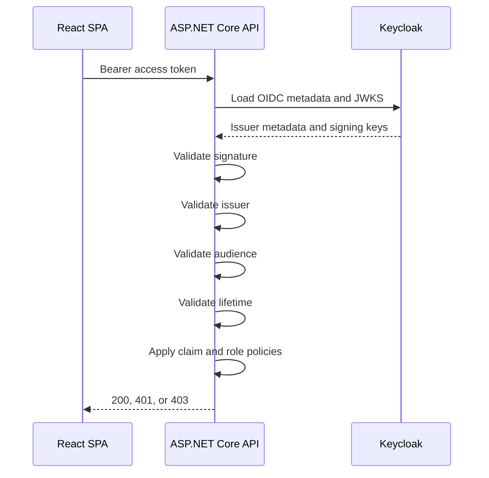

# .NET API to Keycloak Integration Guide

This guide describes how to secure any ASP.NET Core API so it validates bearer tokens issued by Keycloak.

## Tested stack

- .NET 10 preview in this demo
- ASP.NET Core JWT bearer authentication
- Keycloak 26.x

## Required libraries

For a standard ASP.NET Core API, these are the main packages you need:

- `Microsoft.AspNetCore.Authentication.JwtBearer`
- `System.IdentityModel.Tokens.Jwt`

Example install:

```bash
dotnet add package Microsoft.AspNetCore.Authentication.JwtBearer
dotnet add package System.IdentityModel.Tokens.Jwt
```

## Copy-paste starter setup

Use this as the minimum starting point for a new ASP.NET Core API:

```json
{
  "Keycloak": {
    "Authority": "http://localhost:8080/realms/demo-realm",
    "PublicIssuer": "http://localhost:8080/realms/demo-realm",
    "Audience": "dotnet-api",
    "RequireHttpsMetadata": false
  }
}
```

```csharp
using System.IdentityModel.Tokens.Jwt;
using System.Security.Claims;
using Microsoft.AspNetCore.Authentication;
using Microsoft.AspNetCore.Authentication.JwtBearer;

JwtSecurityTokenHandler.DefaultMapInboundClaims = false;

builder.Services.AddTransient<IClaimsTransformation, KeycloakClaimsTransformation>();

builder.Services
    .AddAuthentication(JwtBearerDefaults.AuthenticationScheme)
    .AddJwtBearer(options =>
    {
        options.Authority = keycloakOptions.Authority;
        options.RequireHttpsMetadata = keycloakOptions.RequireHttpsMetadata;
        options.TokenValidationParameters.ValidateIssuer = true;
        options.TokenValidationParameters.ValidIssuer = keycloakOptions.PublicIssuer;
        options.TokenValidationParameters.ValidateAudience = true;
        options.TokenValidationParameters.ValidAudience = keycloakOptions.Audience;
        options.TokenValidationParameters.NameClaimType = "preferred_username";
        options.TokenValidationParameters.RoleClaimType = ClaimTypes.Role;
    });
```

## Prerequisites

- A running Keycloak instance
- A realm for the application
- An API audience or client definition in Keycloak
- An ASP.NET Core API project

## Step-by-step setup

1. Decide what the API should accept.
   - Which Keycloak realm issues the token
   - Which audience the token must contain
   - Which claims or roles are needed for authorization

1. Add JWT bearer authentication to the API.
   - Use ASP.NET Core JWT bearer auth
   - Point `Authority` at the Keycloak realm
   - Configure the expected `Audience`

1. If Docker is involved, separate discovery from issuer if needed.
   - Containers may need to reach Keycloak by an internal hostname such as `http://keycloak:8080`
   - Browser-issued tokens may still have a public issuer such as `http://localhost:8080`
   - If those differ, fetch metadata using the internal authority but validate the token against the public issuer

1. Configure validation explicitly.
   - Validate issuer
   - Validate audience
   - Validate lifetime
   - Validate signature using Keycloak metadata and JWKS

1. Disable default inbound claim remapping if you want predictable claim names.
   - Keep claims like `preferred_username`, `department`, and `iss` in their original names

1. Add authorization policies.
   - Require authentication for general protected endpoints
   - Add claim-based policies for business rules, for example `department=finance`
   - Add role-based policies if you expose Keycloak roles as role claims

1. Normalize Keycloak-specific claims if necessary.
   - Realm roles are often nested under `realm_access.roles`
   - If your app expects standard ASP.NET role claims, add a claims transformation step

1. Protect controllers and endpoints.
   - Use `[Authorize]` for any authenticated user
   - Use `[Authorize(Policy = "...")]` for claim-specific or role-specific routes

1. Add CORS if the API is called from a browser app.
   - Restrict allowed origins to your frontend
   - Allow the `Authorization` header

1. Add diagnostics for troubleshooting.
   - A small authenticated diagnostics endpoint is useful during development
   - Return config values such as authority, public issuer, audience, and observed token metadata

## Example configuration

Example `appsettings.json`:

```json
{
  "Keycloak": {
    "Authority": "http://localhost:8080/realms/demo-realm",
    "PublicIssuer": "http://localhost:8080/realms/demo-realm",
    "Audience": "dotnet-api",
    "RequireHttpsMetadata": false
  }
}
```

Example options class:

```csharp
public sealed class KeycloakOptions
{
    public const string SectionName = "Keycloak";

    public string Authority { get; init; } = string.Empty;
    public string PublicIssuer { get; init; } = string.Empty;
    public string Audience { get; init; } = string.Empty;
    public bool RequireHttpsMetadata { get; init; }
}
```

## Example JWT bearer setup

```csharp
using System.IdentityModel.Tokens.Jwt;
using System.Security.Claims;
using Microsoft.AspNetCore.Authentication.JwtBearer;

JwtSecurityTokenHandler.DefaultMapInboundClaims = false;

builder.Services
    .AddAuthentication(JwtBearerDefaults.AuthenticationScheme)
    .AddJwtBearer(options =>
    {
        options.Authority = keycloakOptions.Authority;
        options.RequireHttpsMetadata = keycloakOptions.RequireHttpsMetadata;
        options.TokenValidationParameters.ValidateIssuer = true;
        options.TokenValidationParameters.ValidIssuer = keycloakOptions.PublicIssuer;
        options.TokenValidationParameters.ValidateAudience = true;
        options.TokenValidationParameters.ValidAudience = keycloakOptions.Audience;
        options.TokenValidationParameters.NameClaimType = "preferred_username";
        options.TokenValidationParameters.RoleClaimType = ClaimTypes.Role;
    });
```

What this gives you:

- signature validation using Keycloak metadata and JWKS
- issuer validation
- audience validation
- standard JWT lifetime validation

## Example authorization policy

```csharp
builder.Services.AddAuthorization(options =>
{
    options.AddPolicy("FinanceDepartment", policy =>
    {
        policy.RequireAuthenticatedUser();
        policy.RequireClaim("department", "finance");
    });
});
```

Example controller:

```csharp
using Microsoft.AspNetCore.Authorization;
using Microsoft.AspNetCore.Mvc;

[ApiController]
[Route("api/[controller]")]
public class DemoController : ControllerBase
{
    [HttpGet("protected")]
    [Authorize]
    public IActionResult Protected() => Ok(new { message = "Authenticated" });

    [HttpGet("finance")]
    [Authorize(Policy = "FinanceDepartment")]
    public IActionResult Finance() => Ok(new { message = "Finance only" });
}
```

## Example claim normalization

Keycloak realm roles are often nested. If you want them as ASP.NET role claims:

```csharp
using System.Security.Claims;
using System.Text.Json;
using Microsoft.AspNetCore.Authentication;

public sealed class KeycloakClaimsTransformation : IClaimsTransformation
{
    public Task<ClaimsPrincipal> TransformAsync(ClaimsPrincipal principal)
    {
        if (principal.Identity is not ClaimsIdentity identity || !identity.IsAuthenticated)
        {
            return Task.FromResult(principal);
        }

        var realmAccessJson = principal.FindFirst("realm_access")?.Value;
        if (string.IsNullOrWhiteSpace(realmAccessJson))
        {
            return Task.FromResult(principal);
        }

        using var document = JsonDocument.Parse(realmAccessJson);
        if (!document.RootElement.TryGetProperty("roles", out var rolesElement))
        {
            return Task.FromResult(principal);
        }

        foreach (var role in rolesElement.EnumerateArray())
        {
            var roleName = role.GetString();
            if (!string.IsNullOrWhiteSpace(roleName) && !identity.HasClaim(ClaimTypes.Role, roleName))
            {
                identity.AddClaim(new Claim(ClaimTypes.Role, roleName));
            }
        }

        return Task.FromResult(principal);
    }
}
```

Register it:

```csharp
builder.Services.AddTransient<IClaimsTransformation, KeycloakClaimsTransformation>();
```

## Example diagnostics endpoint

```csharp
[HttpGet("diagnostics")]
[Authorize]
public IActionResult Diagnostics()
{
    return Ok(new
    {
        keycloakOptions.Authority,
        keycloakOptions.PublicIssuer,
        keycloakOptions.Audience,
        TokenIssuer = User.FindFirst("iss")?.Value,
        TokenAudience = User.FindFirst("aud")?.Value,
        Username = User.FindFirst("preferred_username")?.Value
    });
}
```

## Sequence diagram



## Example decoded token payload

This is the kind of token payload the API is validating:

```json
{
  "iss": "http://localhost:8080/realms/demo-realm",
  "aud": ["account", "dotnet-api"],
  "preferred_username": "alice",
  "department": "finance",
  "realm_access": {
    "roles": ["app-user", "finance-reader"]
  },
  "exp": 1893456789
}
```

The API must not trust these claims unless the signature, issuer, audience, and lifetime all validate first.

## How to adapt this to another .NET API

When reusing this pattern:

- Change:
  - `Authority`
  - `PublicIssuer`
  - `Audience`
  - CORS origins
  - policy names and required claims
- Keep:
  - JWT bearer auth
  - issuer and audience validation
  - disabled inbound claim remapping
  - structured diagnostics endpoint
- Decide per API:
  - whether to normalize Keycloak roles
  - whether policies are claim-based, role-based, or both
  - whether all services share one audience or each service gets its own

## Gotchas

- A token can be valid in the browser and still fail in the API because of issuer mismatch.
- Audience mismatch is another very common reason for `401 Unauthorized`.
- If you are using Docker, `localhost` inside a container does not mean the host machine.
- If the API runs in Docker and Keycloak runs in Docker, you may need:
  - `Authority=http://keycloak:8080/realms/...`
  - `PublicIssuer=http://localhost:8080/realms/...`
- If the API accepts a tampered token, signature validation is not configured correctly.
- If authorization fails with `403`, authentication likely worked and the claim or role policy is what rejected the user.
- If the API cannot load Keycloak metadata, check network reachability from the API runtime, not just from your browser.

## Troubleshooting matrix

| Symptom | Likely cause | Where to look | Fix |
| --- | --- | --- | --- |
| `401` on every endpoint | Issuer or audience mismatch | API logs, diagnostics endpoint | Correct `Authority`, `PublicIssuer`, or `Audience` |
| `401` only after login | Browser token valid, API validation wrong | API logs | Check public issuer versus Docker authority split |
| `403` on restricted endpoint | Claim or role missing | decoded token, policies | Fix claim mapping or policy |
| Token accepted even when modified | Signature validation not active | `Program.cs` auth setup | Ensure JWT bearer with Keycloak authority is configured |
| Roles missing in code | Keycloak roles still nested | claims transformation | Map `realm_access.roles` to ASP.NET role claims |
| API startup fails loading config | Missing Keycloak settings | appsettings or env vars | Fill `Authority`, `PublicIssuer`, `Audience` |

## Tips and tricks

- Keep Keycloak auth settings in one config section such as:
  - `Authority`
  - `PublicIssuer`
  - `Audience`
  - `RequireHttpsMetadata`
- Log authentication failures in development. The exact issuer or audience mismatch usually appears in the exception.
- Add one endpoint that returns current user claims so frontend and backend teams can compare what the token contains.
- If you want a full working sample, this repository already contains:
  - `backend/src/KeycloakDemo.Api/Program.cs`
  - `backend/src/KeycloakDemo.Api/Auth/KeycloakClaimsTransformation.cs`
  - `backend/src/KeycloakDemo.Api/Controllers/AuthController.cs`
- Keep integration tests for:
  - no token returns `401`
  - valid token returns `200`
  - missing required claim returns `403`
  - required claim returns `200`
- Treat `RequireHttpsMetadata=false` as a local-only development setting.

## Minimum secure production changes

Before using this pattern in production:

- Use HTTPS and `RequireHttpsMetadata=true`
- Use production issuer URLs
- Decide whether each API should have its own audience
- Limit accepted CORS origins
- Review token lifetime and clock skew
- Log auth failures without leaking token contents
- Use separate config per environment

## Quick validation checklist

- No token returns `401`
- Valid token returns `200`
- Tampered token returns `401`
- Wrong audience returns `401`
- Wrong issuer returns `401`
- Missing required claim returns `403`
- Correct claim returns `200`
- Diagnostics endpoint reports expected authority, issuer, and audience

## Related reading

- `docs/keycloak-setup-guide.md`
- `docs/react-keycloak-integration.md`
- `docs/authentication-authorization-flow.md`
- `docs/glossary.md`
