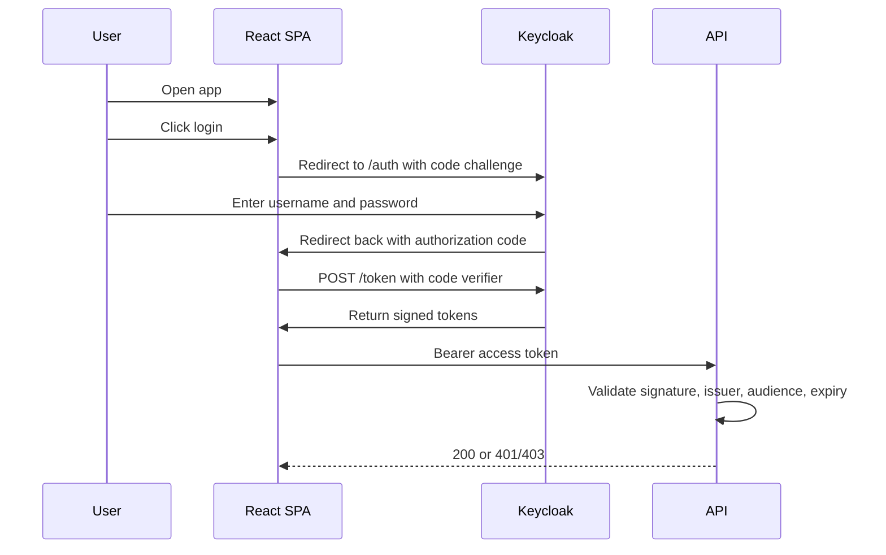

# React to Keycloak Integration Guide

This guide describes the minimum setup needed for any React application to authenticate users with Keycloak using Authorization Code Flow with PKCE.

## Tested stack

- React 18
- TypeScript 5
- Vite 5
- Optional OIDC helper: `oidc-client-ts`
- Keycloak 26.x

## Recommended libraries

You have two realistic options for React:

1. Use a lightweight standards-based OIDC client
   - `oidc-client-ts`
   - Good if you want less custom auth code

2. Build the flow directly with browser APIs
   - No extra auth library required
   - You still need your normal React stack such as:
     - `react`
     - `react-dom`
     - `typescript`
     - `vite` or your preferred bundler

For most teams, `oidc-client-ts` is the fastest reusable option.

Example install:

```bash
npm install oidc-client-ts
```

## Copy-paste starter setup

Use this as the minimum starting point for a new React SPA:

```env
VITE_KEYCLOAK_URL=http://localhost:8080
VITE_KEYCLOAK_REALM=demo-realm
VITE_KEYCLOAK_CLIENT_ID=react-spa
VITE_KEYCLOAK_REDIRECT_URI=http://localhost:5173/auth/callback
VITE_API_BASE_URL=http://localhost:8081
```

```ts
// src/auth/config.ts
export const authConfig = {
  keycloakUrl: import.meta.env.VITE_KEYCLOAK_URL,
  realm: import.meta.env.VITE_KEYCLOAK_REALM,
  clientId: import.meta.env.VITE_KEYCLOAK_CLIENT_ID,
  redirectUri: import.meta.env.VITE_KEYCLOAK_REDIRECT_URI,
  apiBaseUrl: import.meta.env.VITE_API_BASE_URL
};
```

## Prerequisites

- A running Keycloak instance
- A realm created for your application
- A React application running in the browser
- A redirect URL for local development, for example `http://localhost:5173/auth/callback`

## Step-by-step setup

1. Create a public client in Keycloak.
   - Set `Client ID` to your app name, for example `react-spa`
   - Keep the client type as OpenID Connect
   - Configure the client as a public browser client
   - Enable standard authorization code flow
   - Disable direct access grants for normal SPA usage

1. Configure redirect URLs and web origins.
   - Add your callback URL, for example `http://localhost:5173/*`
   - Add your frontend origin, for example `http://localhost:5173`
   - Add logout redirect URLs if you want Keycloak logout to return to the app

1. Enable PKCE.
   - Require or configure `S256` as the PKCE code challenge method
   - Do not use implicit flow for new React apps

1. Decide which claims the frontend needs.
   - Keep the explicit scope request minimal, usually `openid`
   - Add `profile`, `email`, roles, and custom claims through Keycloak default client scopes where possible

1. In React, keep these values in environment config.
   - Keycloak base URL
   - Realm name
   - Client ID
   - Redirect URI
   - API base URL if the app calls a backend

Example Vite env file:

```env
VITE_KEYCLOAK_URL=http://localhost:8080
VITE_KEYCLOAK_REALM=demo-realm
VITE_KEYCLOAK_CLIENT_ID=react-spa
VITE_KEYCLOAK_REDIRECT_URI=http://localhost:5173/auth/callback
VITE_API_BASE_URL=http://localhost:8081
```

## Sequence diagram



1. On login, redirect the browser to Keycloak.
   - Generate a PKCE verifier and challenge
   - Generate a random state value
   - Redirect to the Keycloak authorization endpoint with:
     - `client_id`
     - `redirect_uri`
     - `response_type=code`
     - `scope=openid`
     - `state`
     - `code_challenge`
     - `code_challenge_method=S256`

1. Handle the callback route.
   - Read `code` and `state` from the URL
   - Verify the returned `state` matches the saved value
   - Exchange the authorization code for tokens at the token endpoint

1. Store tokens carefully.
   - Prefer short-lived in-memory or session-scoped storage for demos
   - Avoid long-term local storage unless you accept the XSS tradeoff
   - Clear tokens on logout and when they expire

1. Add the access token to API requests.
   - Send `Authorization: Bearer <access_token>`
   - Handle `401` and `403` cleanly in the UI

1. Implement logout.
   - Clear the local session
   - Redirect to Keycloak logout with a post-logout redirect URI
   - Include `id_token_hint` when available

## Example using `oidc-client-ts`

Create an auth client:

```ts
// src/auth.ts
import { UserManager } from "oidc-client-ts";

const authority = `${import.meta.env.VITE_KEYCLOAK_URL}/realms/${import.meta.env.VITE_KEYCLOAK_REALM}`;

export const userManager = new UserManager({
  authority,
  client_id: import.meta.env.VITE_KEYCLOAK_CLIENT_ID,
  redirect_uri: import.meta.env.VITE_KEYCLOAK_REDIRECT_URI,
  post_logout_redirect_uri: "http://localhost:5173",
  response_type: "code",
  scope: "openid",
  automaticSilentRenew: false
});
```

Login and callback handling:

```ts
// login button
await userManager.signinRedirect();

// callback route
const user = await userManager.signinRedirectCallback();
const accessToken = user.access_token;
```

Calling an API:

```ts
const user = await userManager.getUser();

const response = await fetch(`${import.meta.env.VITE_API_BASE_URL}/api/demo/protected`, {
  headers: {
    Authorization: `Bearer ${user?.access_token}`
  }
});
```

Logout:

```ts
await userManager.signoutRedirect();
```

## Example without an OIDC library

If you want full control, you can build the flow manually. The core pieces are:

```ts
const realmBaseUrl = `${keycloakUrl}/realms/${realm}/protocol/openid-connect`;

const authUrl = new URL(`${realmBaseUrl}/auth`);
authUrl.searchParams.set("client_id", clientId);
authUrl.searchParams.set("redirect_uri", redirectUri);
authUrl.searchParams.set("response_type", "code");
authUrl.searchParams.set("scope", "openid");
authUrl.searchParams.set("state", state);
authUrl.searchParams.set("code_challenge", codeChallenge);
authUrl.searchParams.set("code_challenge_method", "S256");

window.location.assign(authUrl.toString());
```

Token exchange:

```ts
const response = await fetch(`${realmBaseUrl}/token`, {
  method: "POST",
  headers: {
    "Content-Type": "application/x-www-form-urlencoded"
  },
  body: new URLSearchParams({
    grant_type: "authorization_code",
    client_id: clientId,
    code,
    redirect_uri: redirectUri,
    code_verifier: codeVerifier
  })
});
```

This repo already contains a working manual implementation you can copy from:

- `frontend/src/auth/oidc.ts`
- `frontend/src/auth/pkce.ts`
- `frontend/src/App.tsx`

## Example decoded access token payload

This is the kind of payload your frontend can expect to send to APIs:

```json
{
  "iss": "http://localhost:8080/realms/demo-realm",
  "aud": ["account", "dotnet-api"],
  "sub": "2d1f8d7d-1234-4567-8901-abcdef123456",
  "preferred_username": "alice",
  "department": "finance",
  "realm_access": {
    "roles": ["app-user", "finance-reader"]
  },
  "exp": 1893456789
}
```

The frontend can inspect claims for display and diagnostics, but it must not be treated as the authority for authorization. The APIs must validate and enforce access.

## How to adapt this to another React app

When you reuse this pattern in another app:

- Change:
  - realm name
  - client ID
  - redirect URI
  - logout URI
  - API base URL
- Keep:
  - Authorization Code Flow with PKCE
  - hosted login on Keycloak
  - minimal explicit scope request
  - bearer token attachment in one shared API client
- Decide per app:
  - whether to use `oidc-client-ts` or manual code
  - whether to use session storage, in-memory storage, or a BFF pattern
  - which claims are only for display and which the backend will enforce

## Gotchas

- Do not let the React app collect username and password directly. Use Keycloak’s hosted login page.
- If Keycloak says `Invalid scopes`, reduce the explicit scope request to `openid` and move extra claims into default client scopes.
- If the login button seems dead, avoid relying on browser-time OIDC discovery if you do not need it. Building the auth URL directly from the configured realm is often simpler.
- Redirect URI mismatches are one of the most common causes of failed login.
- If logout works inconsistently, check the configured post-logout redirect URIs in Keycloak.
- If the user logs in successfully but the API returns `401`, the frontend may be fine and the backend token validation may be wrong.
- In React development mode, callback logic can run twice. Make sure the auth code is removed from the URL before a second render can redeem it again.

## Troubleshooting matrix

| Symptom | Likely cause | Where to look | Fix |
| --- | --- | --- | --- |
| Login button does nothing | Redirect logic failed before navigation | browser console, auth module | Build auth URL directly, surface errors in UI |
| Keycloak says `Invalid scopes` | Frontend requested unsupported scopes | browser network tab, Keycloak logs | Request only `openid`, move extra claims to client scopes |
| Callback shows `invalid_grant` | Code redeemed twice or redirect mismatch | callback logic, network tab | Remove code from URL before second render, confirm redirect URI |
| API returns `401` | Token validation failed | backend logs, diagnostics endpoint | Check issuer, audience, expiry, signature |
| API returns `403` | User authenticated but lacks claim | backend policy config, decoded claims | Adjust policy or claim mapping |
| Logout returns to wrong page | Post logout redirect mismatch | Keycloak client settings | Add correct post logout redirect URI |

## Tips and tricks

- Show decoded token claims in a debug panel during development.
- Keep auth logic in one module or provider instead of scattering it across components.
- Store PKCE verifier and state in `sessionStorage` for a simple SPA flow.
- Request only `openid` explicitly unless you have a reason to ask for more. Let Keycloak default client scopes provide `profile` and `email`.
- Use separate buttons or views for:
  - login state
  - user profile
  - protected API calls
  - authorization failure scenarios
- For production, consider whether a backend-for-frontend pattern is better than a pure browser token model.

## Minimum secure production changes

Before using this pattern beyond local development:

- Use HTTPS everywhere
- Do not leave Keycloak realm SSL requirement at `none`
- Review whether browser token storage is acceptable or whether you need a BFF
- Use real production redirect URIs and logout URIs
- Use separate realms, clients, and users for each environment
- Reduce claim exposure to only what the frontend and APIs actually need
- Review token lifetime and refresh-token strategy

## Quick validation checklist

- Login redirects to Keycloak
- Keycloak redirects back to the callback route
- Token exchange completes without errors
- A valid access token is stored for the current session
- Protected API calls include the bearer token
- Unauthenticated calls fail with `401`
- Authorization failures return `403`
- Logout clears the local session and returns to the app

## Related reading

- `docs/keycloak-setup-guide.md`
- `docs/dotnet-api-keycloak-integration.md`
- `docs/authentication-authorization-flow.md`
- `docs/glossary.md`
